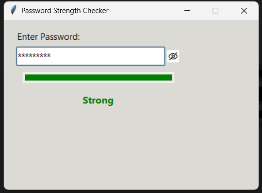

# 🔐 Task 1: Password Strength Checker

This task is part of my internship project and involves building a simple yet functional password strength checker using Python and Tkinter. The application evaluates password strength based on length, character variety, and complexity, and displays the result using a progress bar and color-coded feedback.

---

## 📁 Files Included

- `password_checker.py`: Main Python script for the GUI-based password strength checker.
- `output.mp4`: A video demonstration of the project in action.
- `eye.png`, `eye_closed.png`: Image assets used for toggling password visibility.

---

## 🖼️ Image Assets Used

This project uses two image files for toggling password visibility:

- `eye.png`: Icon for showing the password.
- `eye_closed.png`: Icon for hiding the password.

These images are stored in the `assets/` folder for better organization in this GitHub repository.

> ⚠️ **Note:** The original code submitted for the internship expects these images to be in the same directory as the Python file.  
> To run the code successfully, please copy `eye.png` and `eye_closed.png` from the `assets/` folder into the same folder as `password_checker.py`.

---

## 🎥 Output Video

[▶️ Watch the output demonstration](output.mp4)

---

## 🖼️ Screenshot

---

## ✅ Summary

This task demonstrates:
- GUI design using Tkinter and ttk
- Real-time password strength evaluation
- Use of image assets and progress bars
- Clean code structure and user-friendly interface
