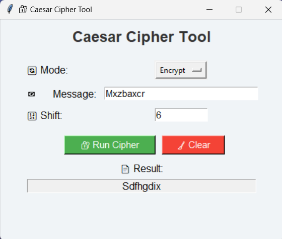

---

## 🧠 What is Caesar Cipher?

Caesar Cipher is one of the oldest and simplest encryption techniques. Each letter in the plaintext is shifted a fixed number of positions down the alphabet.

**Example**:  
Message: `HELLO`  
Shift: `3`  
Encrypted: `KHOOR`

---

## 📁 Files Included

- `encryption_ceaser.py`: Main Python script for the GUI-based Caesar Cipher tool.
- `output.mp4`: A video demonstration of the project in action.
- `preview.png`: Screenshot of the application interface.

---

## 🖥️ Features

- ✅ GUI built with **Tkinter**
- ✅ Supports both **encryption** and **decryption**
- ✅ Preserves **uppercase/lowercase** letters
- ✅ Ignores non-alphabetic characters (punctuation, numbers)
- ✅ Clean layout with emojis and color styling
- ✅ Includes a **Clear** button to reset fields

---

## 🧠 How It Works

The Caesar Cipher is a classic substitution cipher where each letter in the plaintext is shifted a certain number of places down or up the alphabet.

- **Encrypt Mode**: Shifts letters forward by the specified amount.
- **Decrypt Mode**: Shifts letters backward using the same key.
- Non-alphabetic characters remain unchanged.

---

## 🚀 How to Run

1. Make sure you have Python installed.
2. Open a terminal or command prompt.
3. Run the script:

```bash
python encryption_ceaser.py

---

## 🎥 Output Video

[▶️ Watch the output demonstration](output.mp4)

---

## 🖼️ Screenshot



---

## ✅ Summary

This task demonstrates:

- GUI design using Tkinter
- Implementation of Caesar Cipher logic
- Input validation and error handling
- Clean layout and user-friendly interface
- Use of emojis and color-coded buttons for better UX

---
